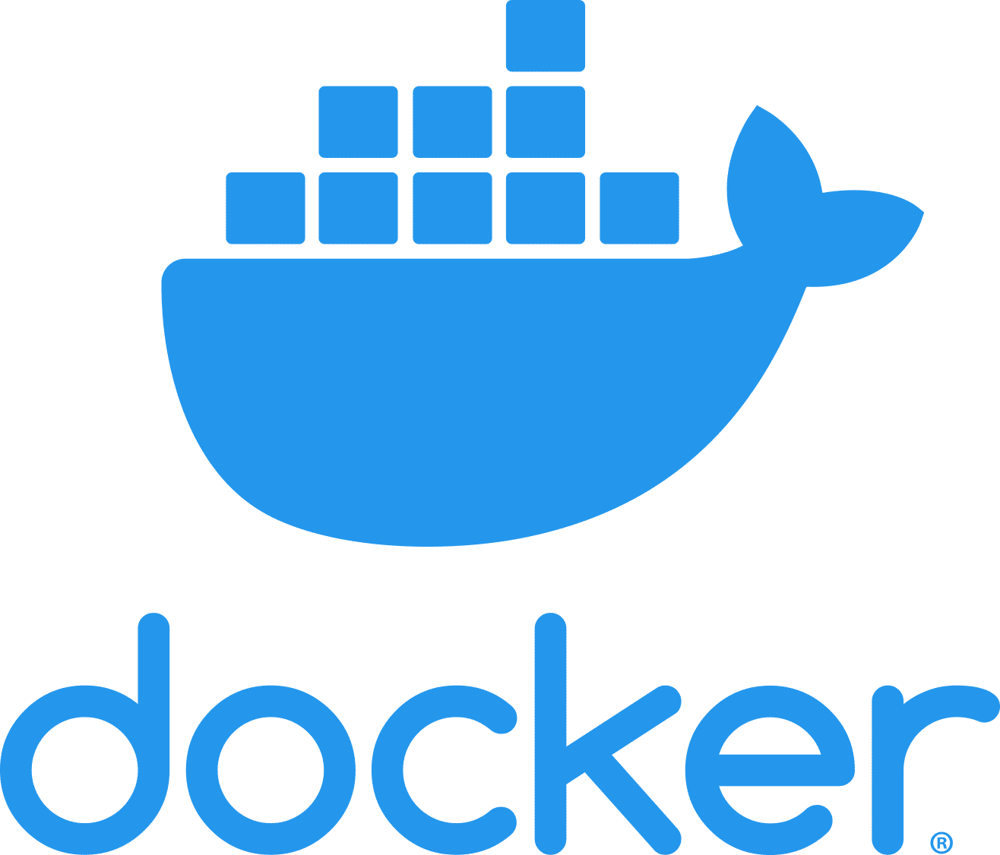

### Hi, I'm [Boba][website]!

Full Stack [FiveM][fivem] & Web Developer, currently working on [Production RP][productionrp]

[][twitch]

#### Currently working with:

<!-- 
 -->

    
    
    
    
    
    
    
    

[website]: https://bobatea.dev/
[twitch]: https://twitter.com/bobathedev
[productionrp]: https://www.productionrp.net/
[fivem]: https://fivem.net/

